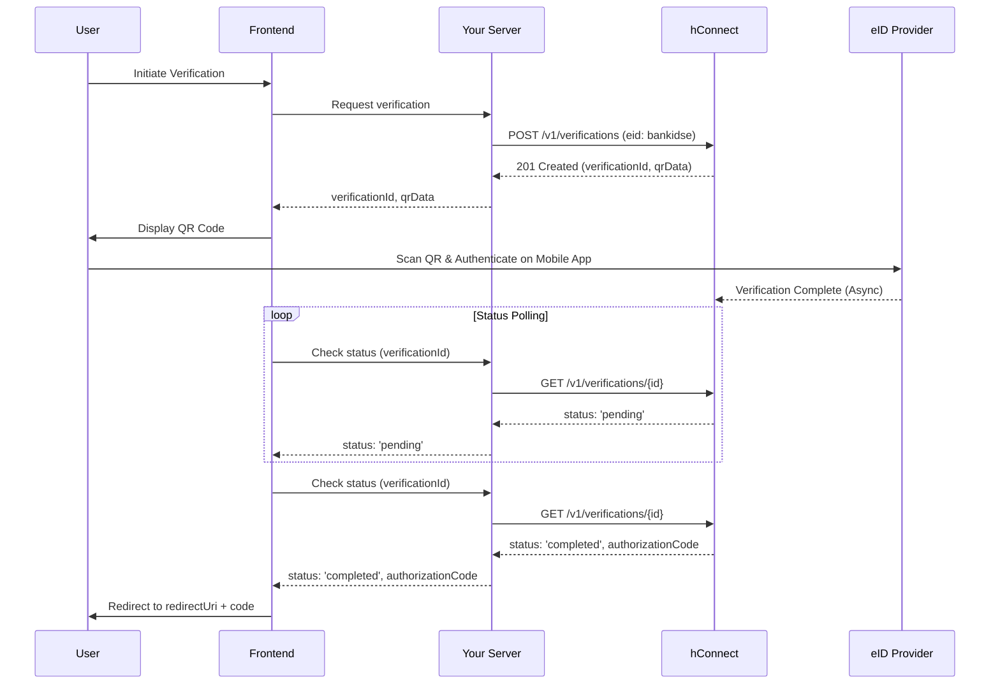

# Guide: QR Flow Integration

QR code-based verification (e.g., BankID SE, KMDL) is an asynchronous flow where the user authenticates on their mobile device after scanning a QR code from a web screen. This guide explains how to build a robust integration.

### Core Concept: The Role of `redirectUri` in QR Flows

While the authentication happens out-of-band on the user's mobile device, the final result must be securely delivered back to the web browser where the journey began. The `redirectUri` is the **`final destination for delivering the authorization_code after a successful verification`**. It's used in combination with polling to create a seamless user experience.

### Step-by-Step Integration

#### Step 1: Initiate Verification and Display QR Code

While `redirectUri` is not strictly required in the `POST /v1/verifications` request for a QR flow, it is **highly recommended** for the final user redirect. If omitted, the default Redirect URI from your application settings in the dashboard will be used.

```bash cURL
# Example: BankID SE verification request
curl --request POST \
  --url https://api-gw.test.hopae.com/v1/verifications \
  --user "YOUR_CLIENT_ID:YOUR_CLIENT_SECRET" \
  --header "Content-Type: application/json" \
  --data '{
    "eid": "bankidse",
    "redirectUri": "https://yourapp.com/auth/callback"
  }'
```

Use the `flowDetails.qrData` from the response to generate and display a QR code on your webpage.

#### Step 2: Poll for Status and Handle the Result

From your frontend, periodically call your backend (which in turn calls `GET /v1/verifications/{verificationId}`) every 3-5 seconds to check the status.

```javascript
// Frontend Polling Example
const verificationId = '39bmoa...';

const intervalId = setInterval(async () => {
  // Your backend should proxy this call to hConnect to protect your secret
  const response = await fetch(`/api/get-verification-status?id=${verificationId}`);
  const data = await response.json();

  if (data.status === 'completed') {
    clearInterval(intervalId);
    handleAuthSuccess(data); // Proceed to Step 3
  } else if (['failed', 'expired', 'cancelled'].includes(data.status)) {
    clearInterval(intervalId);
    handleAuthFailure(data.error);
  }
}, 3000);
```

#### Step 3: Complete Authentication and Final Redirect

When the `status` becomes `completed`, the response will contain an `authorizationCode`. Use this code to redirect the user to your `redirectUri`.

**`✅ Final Completed Response (GET /verifications/{id}):`**

```json
{
  "verificationId": "ver_...",
  "status": "completed",
  "authorizationCode": "auth_code_for_token_exchange", // <-- Use this code!
  "verifiedAttributes": { ... }
}
```

Now, from your frontend, use the `authorizationCode` to perform the redirect.

```typescript
// Frontend Success Handler Example
function handleAuthSuccess(verificationResult) {
  const code = verificationResult.authorizationCode;
  const redirectUri = new URL("https://yourapp.com/auth/callback"); // The URI from Step 1
  redirectUri.searchParams.set('code', code);
  
  window.location.href = redirectUri.toString();
}
```

From here, the process is the same as the standard OIDC flow: call the `POST /token` endpoint to exchange the code for an `id_token`.

### Sequence Diagram

